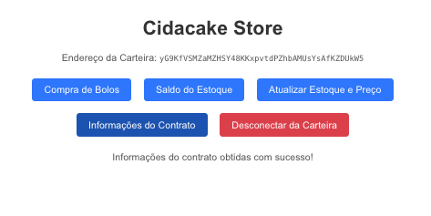

# Cidacake Store

Bem-vindo ao **Cidacake Store**, uma aplicação descentralizada (dApp) construída na blockchain Solana para compra e gerenciamento de bolos virtuais. Este projeto interage com o programa Solana `cidacake-program` e permite aos usuários conectar suas carteiras, comprar bolos, consultar o estoque, atualizar o estoque e o preço, e visualizar informações detalhadas do contrato.



## Funcionalidades

- **Conexão com Carteira**: Conecte-se automaticamente à carteira Phantom (suporte para outras carteiras como MetaMask e SafePal foi removido para simplificação).
- **Menu de Ações**: Após o login, um menu de ações é exibido com as seguintes opções:
  - **Compra de Bolos**: Permite comprar bolos virtuais usando a instrução `sell` (ID 3) do programa `cidacake-program`.
  - **Saldo do Estoque**: Consulta o saldo atual do estoque e o preço por bolo, deserializando a estrutura `CakeState` (stock, price, owner) da conta `CAKE_ACCOUNT`.
  - **Atualizar Estoque e Preço**:
    - **Atualizar Estoque**: Inicializa ou realoca a conta `CAKE_ACCOUNT` com a instrução `initialize` (ID 0).
    - **Atualizar Preço**: Atualiza o preço por bolo usando a instrução `update_price` (ID 2).
  - **Informações do Contrato**: Exibe informações detalhadas do contrato, incluindo:
    - Programa: ID do programa, saldo em SOL, e se é executável.
    - Conta de Estoque: Endereço, saldo em SOL, espaço alocado, época de aluguel, e se é executável.
    - Proprietário: Endereço e saldo em SOL.
    - Conta de Pagamentos: Endereço, saldo em SOL, e se é uma conta de token SPL (com detalhes adicionais se aplicável).
  - **Desconectar da Carteira**: Desconecta a carteira e limpa o estado da aplicação.
- **Estilização Melhorada**: A interface foi estilizada com um design moderno, incluindo tabelas organizadas, seções agrupadas, e botões com efeitos de hover.

## Pré-requisitos

- **Node.js** e **npm**: Certifique-se de ter o Node.js instalado (versão recomendada: 16.x ou superior).
- **Carteira Phantom**: Instale a extensão Phantom no seu navegador para interagir com a Solana devnet.
- **IPFS** (opcional): Para hospedar a aplicação de forma descentralizada.

## Instalação

1. **Clone o Repositório**:
   ```bash
   git clone <URL_DO_REPOSITORIO>
   cd cidacake-store